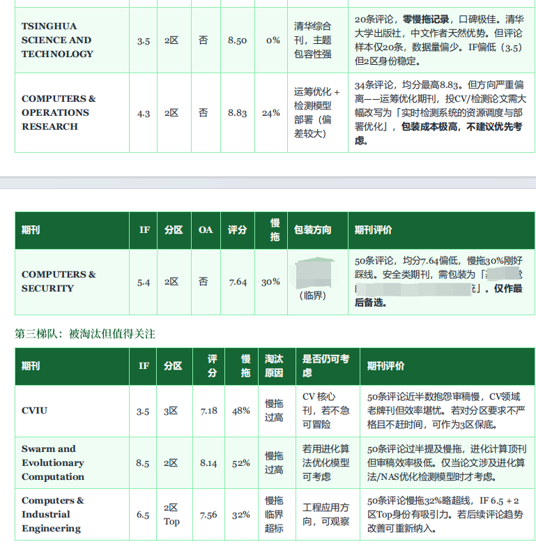

# LetPub Skills

基于 LetPub 的期刊数据爬取工具包，为科研工作者提供期刊查询、评论分析和智能推荐能力。可作为 AI 助手的 Skill 接入，也可独立调用。

## 核心功能

| 功能 | 说明 |
|------|------|
| **查询期刊详情** | 输入期刊名称，返回影响因子、分区、审稿速度等完整信息 |
| **分析期刊评论** | 遍历多页用户投稿评论，综合评判期刊口碑与审稿体验 |
| **推荐投稿期刊** | 根据论文摘要，由 AI 智能检索并推荐合适期刊（含评论质量审核） |

## 快速开始

### 1. 克隆项目

```bash
git clone <repo-url>
cd letpub-skills
```

### 2. 安装依赖

项目依赖 Python 3.8+，需要安装以下包：

```bash
pip install requests beautifulsoup4
```

### 3. 配置 Cookies（重要）

获取期刊评论功能需要 LetPub 的登录 cookies。请按以下步骤提取并填写：

#### 步骤一：登录 LetPub

在浏览器中打开 [https://letpub.com.cn](https://letpub.com.cn) 并登录你的账号。

#### 步骤二：打开浏览器开发者工具

- **Chrome / Edge**：按 `F12` 或 `Ctrl + Shift + I`
- **Firefox**：按 `F12`
- **Safari**：`偏好设置 → 高级 → 显示开发菜单`，然后按 `Cmd + Option + I`

#### 步骤三：提取 Cookie

1. 切换到 **Network（网络）** 标签页
2. 在 LetPub 网站上随意点击一个页面（如任意期刊详情页），触发一次请求
3. 在请求列表中点击任意一条请求
4. 在右侧 **Headers（标头）** 面板中找到 **Request Headers → Cookie** 字段
5. **复制整个 Cookie 值**（一长串文本，形如 `PHPSESSID=abc123; security_session_mid_verify=xyz...`）

> **提示**：也可以在开发者工具的 **Application（应用）→ Cookies** 中查看所有 cookie 条目，但直接从 Network 标签复制最方便。

#### 步骤四：填写到配置文件

打开 `assets/cookies.json`，将复制的 cookie 粘贴到 `cookies` 字段中：

```json
{
  "cookies": "PHPSESSID=abc123; security_session_mid_verify=xyz456; ..."
}
```

> ⚠️ **注意**：Cookie 有时效性，通常数小时到数天后过期。如果获取评论时发现翻页始终返回相同数据，说明 cookie 已失效，请重新提取。

## 使用方式

### 推荐结果示例

以下是 AI 根据论文摘要推荐期刊后，经评论质量审核输出的结果：



AI 会将候选期刊分为 **推荐梯队**、**临界备选** 和 **被淘汰但值得关注** 三档，每个期刊附带 IF、分区、OA、评分、慢拖比例及详细评价，帮助你快速决策。

### 作为 AI Skill 使用

将本项目目录添加为 AI 助手的 Skill，AI 会自动阅读 `SKILL.md` 并按照其中的指令调用脚本。你只需用自然语言提问：

- *"帮我查一下 Nature Communications 的影响因子和分区"*
- *"分析一下 Chemical Engineering Science 的用户评论"*
- *"我的论文是关于深度学习在医学影像中的应用，帮我推荐几个合适的 SCI 期刊"*

### 作为 Python 库调用

```python
from scripts.search_journal import search_journal, search_journals_advanced, parse_search_results
from scripts.get_details import parse_journal_detail
from scripts.get_comments import get_journal_comments, parse_comments_response
import requests

# 查询期刊详情
results = search_journal("CHEMICAL ENGINEERING SCIENCE")
journal_id = results[0]['id']
url = f"https://letpub.com.cn/index.php?journalid={journal_id}&page=journalapp&view=detail"
resp = requests.get(url)
detail = parse_journal_detail(resp.text)

# 获取评论（需要 cookies）
comments = []
for page in range(1, 6):
    data = get_journal_comments(journal_id=journal_id, page=page)
    parsed = parse_comments_response(data)
    if not parsed:
        break
    comments.extend(parsed)

# 高级搜索
html = search_journals_advanced(
    searchcategory1="计算机科学",
    searchimpactlow="5",
    searchscitype="SCIE",
    searchsort="impactor"
)
result = parse_search_results(html)
```

## 目录结构

```
letpub-skills/
├── README.md                     # 项目说明（本文件）
├── SKILL.md                      # AI Skill 操作手册
├── assets/
│   └── cookies.json              # LetPub 登录 cookies（用户填写）
├── scripts/
│   ├── search_journal.py         # 期刊搜索（自动补全 + 高级搜索）
│   ├── get_details.py            # 期刊详情解析
│   └── get_comments.py           # 评论获取与解析
└── references/
    ├── search_journal.md         # 搜索参数与学科分类完整数据
    ├── get_journal_detail.md     # 详情字段说明
    └── get_journal_comments.md   # 评论字段说明
```

## 常见问题

### Cookie 过期了怎么办？

重新登录 LetPub，按上面的提取步骤获取新的 cookie，替换 `assets/cookies.json` 中的值即可。

### 如何判断 Cookie 是否失效？

当翻页获取评论时，如果每一页返回的内容完全相同（重复数据），说明 cookie 已失效。

### 评论获取不全？

LetPub 评论按分页返回，默认每页约 10 条。程序会自动翻页，直到无新评论为止。如果期刊评论较少，可能不足 5 页。
## 社区

有问题、建议，或想一起折腾？欢迎来 **[linux.do](https://linux.do)** 社区交流反馈。

## License

MIT
